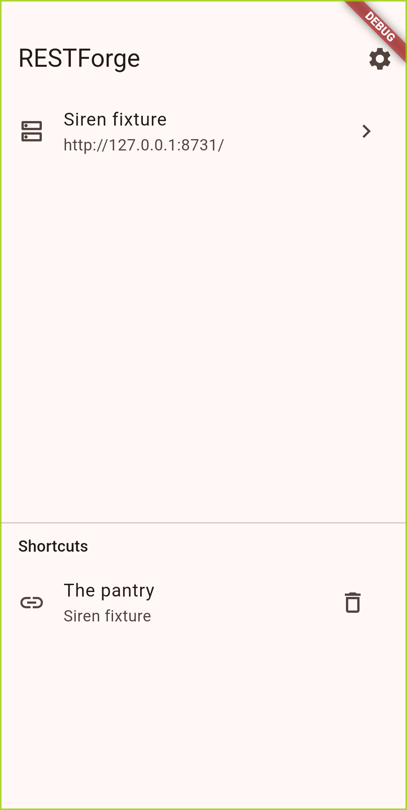
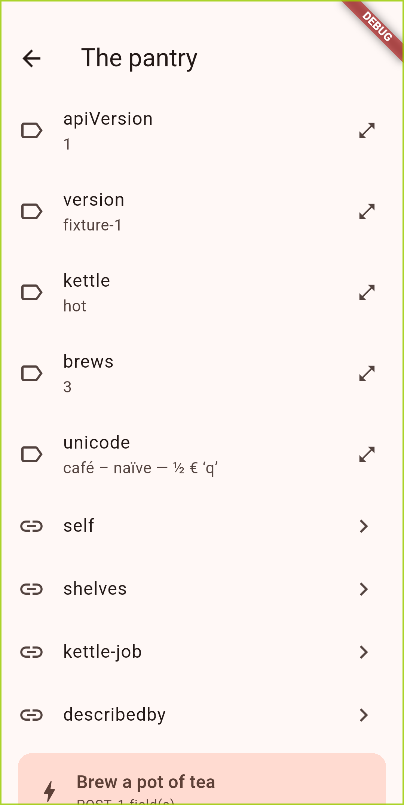
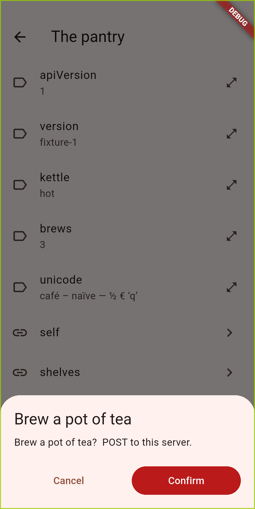
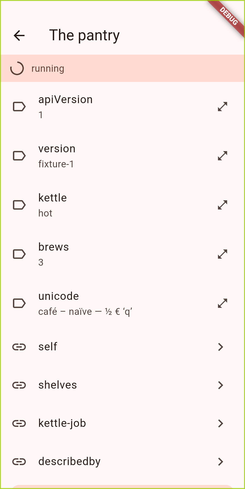
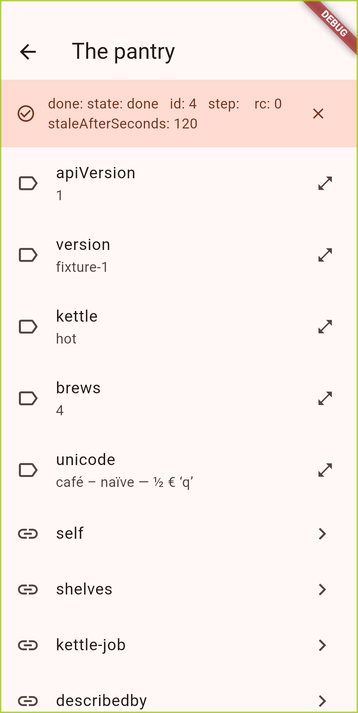

# RESTForge for Android

The Android half of [RESTForge](../README.md): a generic
[Siren](https://github.com/kevinswiber/siren) hypermedia browser that knows
Siren and HTTP and nothing whatsoever about the servers it talks to.

Point it at an API and it renders whatever that API offers — properties,
sub-entities, links and actions. Follow a link and it fetches it. Tap an action
and, after confirming, it performs it, then re-reads the document to see what
changed.

This is a port of the [Pebble watchapp](../pebble/), not a companion to it. The
watchapp is split across two devices because the watch has no IP stack; here
there is one device and no split. What carries over is everything that was
never about the hardware — see [AGENTS.md](AGENTS.md) and
[../pebble/docs/DESIGN.md](../pebble/docs/DESIGN.md).

The screenshots below are the app browsing the fixture Siren API in
[`pebble/tools/`](../pebble/tools/fake-siren-server.py) — an API deliberately
chosen to share no vocabulary with any real server, so what they show is the
one thing a single real backend cannot demonstrate: RESTForge rendering an
API it had never seen until that fetch. Capture them yourself with
`just screenshots` (see Development below).

<p align="center">





</p>

What it does, all of it generic over Siren:

- **Renders whatever a document offers** — properties, embedded sub-entities,
  links and actions, in the order the server sent them, with no vocabulary
  the app has not seen hidden or reworded.
- **Follows links** by the href the server put in the document, resolved
  against the configured base — never builds a URL.
- **Asks before acting**: any method outside `GET`/`HEAD`/`OPTIONS`/`TRACE`
  gets a confirmation, and a required field with no default is asked for out
  loud rather than invented.
- **Re-reads after acting**: every action is followed by an unconditional
  re-fetch, so a `409` is re-read and never retried.
- **Watches long-running jobs** without claiming them finished: a reply
  about a different job, or one saying there is none, is *no news*, and
  giving up is reported as giving up.
- **Keeps a failed request from replacing the document** — the last good
  document stays on screen with the reason laid over it.
- **Saves shortcuts** to places you go often: long-press a link or action
  row to save it, tap it on the opening screen to jump back. An action
  shortcut re-reads the document that offered it and asks again, exactly as
  if you had walked there; a withdrawn action is reported, never a quiet
  failure.

## Requirements

- [Flutter](https://flutter.dev) stable 3.41+ / Dart 3.11+.
- Android builds: Android SDK + JDK 17. On Fedora, GraalVM 17 works — point
  Flutter at it with
  `flutter config --jdk-dir=/usr/lib/jvm/graalvm-community-openjdk-17.0.9+9.1`.
- Linux desktop builds: `gtk3-devel`, `clang`, `cmake`, `ninja-build`,
  `pkg-config`, `xz-devel`.

Flutter is not on `PATH` in a fresh shell on this machine. Either export it —

```sh
export PATH="$HOME/flutter/bin:$PATH"
```

— or pass the binary through the Justfile: `just FLUTTER=$HOME/flutter/bin/flutter test`.

## Development

```sh
just pub-get        # after any pubspec.yaml change
just run-linux      # the fast loop: hot reload, no device needed
just run-android    # on a connected device
just test           # unit and widget tests, no device
just check          # analysis + the genericity grep + the repo-wide secret scan
just screenshots    # capture README screenshots on an Android device/emulator
```

`just check` must print nothing.

`just screenshots` drives the real app against the fixture Siren API on a
connected Android device or emulator and writes PNGs to `screenshots/` —
start an emulator first (`flutter emulators --launch <id>`), then run it.
It starts the fixture on the host and `adb reverse`-routes the device to it
automatically. See [`integration_test/screenshot_test.dart`](integration_test/screenshot_test.dart)
for what it captures.

There is a fixture Siren API in the watchapp's tree, and it works just as well
here — it deliberately shares no vocabulary with anything real, so browsing it
demonstrates the one thing a single real backend cannot: that the app renders an
API it has never seen. It also reproduces the awkward cases on demand — a 401, a
409, a non-JSON response, a request that outruns the read timeout, a job that
takes 24 seconds, and a required field only a human can fill.

```sh
just -f ../pebble/Justfile fixture      # :8731, secret "open-sesame"
```

On a physical Android device, `localhost` is the phone; use the workstation's
LAN address, or `adb reverse tcp:8731 tcp:8731`.

## Release builds

Flutter's Dart AOT compiler emits ARM machine code directly from x86_64 — no
Docker, NDK or cross-compilation setup is needed.

```sh
just build-apk          # per-ABI split APKs (smaller; for distribution)
just build-apk-arm64    # arm64 only
just install-apk        # adb install -r the arm64 release build
just build-linux        # Linux desktop release bundle
```

## Configuring a backend

Backends are configured in the app. Each one needs:

| Field | Meaning |
|---|---|
| Name | What the picker calls it |
| Base URL | The API root, absolute. A trailing `/` is added if you omit it |
| Auth header | Header the secret is sent in. Defaults to `X-API-Key` |
| Secret | The API key |
| Start at rel | Optional: a link `rel` to open immediately after the root |

The secret goes into an `Authorization`-style request header and nowhere else —
never into a query string, which would put it in the server's access log and,
behind a reverse proxy, the proxy's log too. Secrets are stored in
`flutter_secure_storage` (Android Keystore-backed); the rest of a backend
definition is an ordinary preference.
