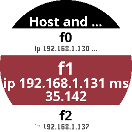
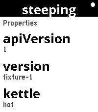

# RESTForge for Pebble

A Pebble watchapp that browses **any** [Siren](https://github.com/kevinswiber/siren)
hypermedia API. It knows Siren, HTTP and AppMessage, and nothing whatsoever
about the servers it talks to.

> This is one of two apps in the repository. The other,
> [`../flutter`](../flutter), is the same browser for Android — no shared code,
> the same contract. See [`../README.md`](../README.md).

Point it at an API, and it renders whatever that API offers: properties,
sub-entities, links and actions. Follow a link and it fetches it. Press an
action and — after confirming — it performs it, then re-reads the document to
see what changed. If the work outlives the request, it keeps watching until the
server says it is done.

Grep the source for the name of any particular API and you will not find one.
That is the point: a client that never builds a URL cannot contain
server-specific code, which is exactly what makes it reusable.

Built for **Pebble Time 2** (emery, 200×228) and **Pebble Round 2** (gabbro,
260×260) only. Both are colour, both have 128 KB of app RAM, and both allow
512-byte font glyphs — which is what makes the deliberately large type
affordable.

## Screenshots

Real captures, against a live API.

| Pebble Round 2 (gabbro) | | |
|:---:|:---:|:---:|
|  |  |  |
| A document | Sub-entities | Confirming an action |

| Pebble Time 2 (emery) | | | |
|:---:|:---:|:---:|:---:|
|  |  |  |  |
| Index rows | The focused row | Confirming an action | Watching a job |

The focused row is the reading surface — the largest face, wrapped, and dropped
a size if a title needs more room than four lines. Every other row is a smaller
index entry over up to two lines, because a label you can read beats a bigger
one you cannot.

## Using it

Backends are configured on the phone, in the Pebble app's settings for
RESTForge. Each one needs:

| Field | Meaning |
|---|---|
| Name | What the watch calls it |
| Base URL | The API root, absolute. A trailing `/` is added if you omit it |
| Auth header | Header the secret is sent in. Defaults to `X-API-Key` |
| Secret | The API key |
| Start at rel | Optional: a link `rel` to open immediately after the root |

**Secrets never leave the phone.** The watch is sent rendered text and nothing
else — no URL, no key, not even an href. It can only say "row 7 was pressed".

On the watch:

| Button | Does |
|---|---|
| **Up** / **Down** | Move through rows, or scroll a full-screen reading view |
| **Select** | Open a row: read a property, follow a link, or invoke an action |
| **Select** (long) | Re-read the current document |
| **Back** | Go back one document; at the backend picker, leave the app |

Any action whose HTTP method is not safe (anything but `GET`, `HEAD`,
`OPTIONS`, `TRACE`) asks for confirmation before sending anything. When the
server attaches a required checkbox to an action, that field's own title is the
question you are asked, and confirming is what fills it in.

## Setup (Fedora + Rebble SDK 4.9+)

```bash
sudo dnf install -y python3-pip nodejs SDL-devel dtc uv just
uv tool install pebble-tool --python 3.13
export PATH="$HOME/.local/bin:$PATH"
pebble sdk install latest
```

The `PATH` export is needed in every new shell; add it to your shell profile to
be rid of it.

## Development

```bash
just dev            # build + install to the round emulator (gabbro)
just dev-emery      # ... or the rectangular one (emery)
just logs           # what the companion is doing (second terminal)
just config         # open the settings page against the emulator
just screenshot
```

There is a fixture API in the repo, deliberately sharing no vocabulary with
anything real — it is about a pantry — so that browsing it demonstrates the one
thing a single real backend cannot: that the app renders an API it has never
seen.

```bash
just fixture        # serves on :8731, secret "open-sesame"
```

It also reproduces the awkward cases on demand: a 401, a 409, a response that
is not JSON, a request that outruns the read timeout, a job that takes 24
seconds to finish, and a required field only a human can fill.

### Tests and checks

```bash
just test           # 323 checks, node only, no emulator
just check          # two greps that cannot fail loudly on their own
```

`just check` is the one to pay attention to. It must print nothing:

- **Secrets** — every file in the working tree, both apps, is scanned for the
  contents of any `~/.*apikey*` file. Keys belong in a file outside the repo,
  mode 0600, pasted into the settings page; never in a commit, a command line,
  or a log.

- **ES5** — the emulator's JavaScript runtime is modern and the watch's is not,
  and the build does not transpile. The emulator is a false green for syntax;
  only this grep catches it.
- **Genericity** — no path, action name or vocabulary belonging to any
  particular server may appear in `src/`.

## How it is put together

See [docs/DESIGN.md](docs/DESIGN.md) for the split between watch and phone, and
[`../docs/DESIGN.md`](../docs/DESIGN.md) for the rules both apps keep. The short version: the watch renders and reports
button presses; PebbleKit JS on the phone does every request, parses every
document, and holds the navigation stack and the secrets.
